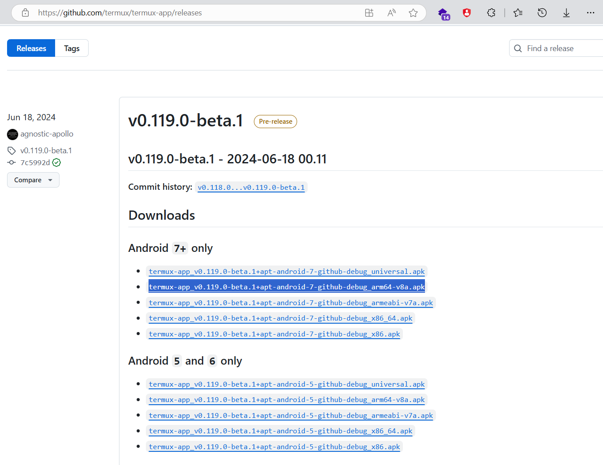

# pertemuan 1

Ini adalah dokumentasi IT CLUB Cyber Harbas untuk pertemuan pertama.

Pada kesempatan ini, saya membuat dokumentasi agar kalian yang tidak dapat hadir tetap bisa mencoba lab yang telah saya buat. Dokumentasi ini akan memandu kalian langkah demi langkah.

Jika kalian tidak memiliki laptop, saya merekomendasikan menggunakan Termux sebagai alternatif. Berikut adalah panduan untuk mengatur Termux agar siap digunakan.

## 1. install termux
Untuk memulai, kalian perlu mengunduh aplikasi Termux. Saya merekomendasikan untuk mengunduhnya melalui GitHub agar mendapatkan versi yang terpercaya:

- [termux-releas](https://github.com/termux/termux-app/releases)
- Atau gunakan tautan berikut untuk langsung mengunduh APK: [github_arm64-v8a.apk](https://github.com/termux/termux-app/releases/download/v0.119.0-beta.1/termux-app_v0.119.0-beta.1+apt-android-7-github-debug_arm64-v8a.apk)

Sebagai referensi, berikut adalah nama aplikasi Termux yang perlu kalian unduh dan disarankan menggunakan arm64

[](https://github.com/termux/termux-app/releases)

## 2. setup termux
untuk melakukan setup termux kalian bisa cek [github saya](hattps://github.com/ariafatah0711/termux_aria) dan lakukan setup, hanya saja karena setupnya itu agak ribet disini saya sudah menyiapkan setup untuk kalian agar tidak perlu lama lama menyalinya

```bash
termux-setup-storage && termux-change-repo && pkg update -y && pkg upgrade -y && pkg install -y git wget zip unzip nano python python2 python3 file tar
```

Jika muncul tampilan berwarna biru, cukup tekan Enter dua kali dan tunggu hingga proses instalasi selesai. 

Setelah itu, kalian dapat langsung mencoba menjalankan perintah-perintah Linux.

## 3. download lab
```bash
wget https://github.com/ariafatah0711/itclub/raw/refs/heads/main/P1/pertemuan_1.tar.gz ;tar -xzf pertemuan_1.tar.gz; rm -rf pertemuan_1.tar.gz
```

# command linux dasar
## file management
|  perintah  |                    deskripsi                    |
|:----------:|:-----------------------------------------------:|
|     pwd    |     Menampilkan working directory saat ini.     |
|     ls     |     Menampilkan isi dari direktori saat ini.    |
|     cd     |           Berpindah ke direktori lain.          |
|    mkdir   |             Membuat direktori baru.             |
|    rmdir   |           Menghapus direktori kosong.           |
|    touch   |             Membuat file baru kosong            |
|  nano / vi |   membuka dan mengedit file teks di terminal.   |
|     rm     |          Menghapus file atau direktori.         |
|     cp     |          Menyalin file atau direktori.          |
|     mv     | Memindahkan atau mengganti nama file/direktori. |
|     cat    |        Menampilkan isi file ke terminal.        |
| head, tail |      Menampilkan baris awal/akhir dari file     |

- Membuat folder/direktori
  ```bash
  mkdir folder
  ```

- Menghapus direktori kosong
  ```bash
  rmdir folder
  ```

- Membuat file dan mengeditnya menggunakan editor nano
  ```bash
  touch file
  nano file
  ```

  Kemudian, ketik teks yang ingin disimpan ke dalam file tersebut.
  - Jika sudah selesai, tekan **Ctrl+O**, tekan **Enter**, lalu tekan **Ctrl+X** untuk keluar.
  - atau tekan **Ctrl+z**, lalu tekan **Y** untuk menyimpan dan **Enter**, atau **N** untuk membatalkan

- Menampilkan isi file
  ```bash
  cat file
  ```

- Menyalin file di direktori saat ini
   ```bash
   cp file file.txt
   ```

- Menghapus file
  ```bash
  rm file
  ```

- Menyalin file dan menyimpannya ke dalam direktori lain
  ```bash
  mkdir folder
  cp file.txt folder/
  ```

- Mengubah nama file dan memindahkannya ke dalam direktori lain
  ```bash
  mv file.txt folder/data.txt
  ```

- Menghapus folder beserta isinya
  - Untuk menghapus folder yang berisi file atau subdirektori, gunakan perintah **rm** dengan opsi **-rf**

  ```bash
  rm -rf folder
  ```

# Command Linux Symbol
## Special Characters
| perintah                    | deskripsi                                                               |
|-----------------------------|-------------------------------------------------------------------------|
| ; (Shell Command Separator) | Menjalankan beberapa perintah secara berurutan (terlepas sukses/gagal)  |
| && (Conditional AND)        | Menjalankan perintah kedua jika perintah pertama sukses.                |
| < (Input Redirection)       | Mengambil input dari file untuk digunakan oleh perintah.                |
| > (Output Redirection)      | Mengarahkan output dari perintah ke file (menimpa file jika sudah ada). |
| \| (Pipe)                   | Mengalirkan output dari satu perintah ke input perintah berikutnya.     |
| \ (backslash)               | Melanjutkan Perintah ke Baris Berikutnya                                |

- Menjalankan beberapa perintah
  ```bash
  cd pertemuan_1/folder
  cat file1.txt ; cat file2.txt ; cat file3.txt
  cat file1.txt && cat file2.txt && cat file3.txt
  ```

  - Perintah pertama menggunakan tanda semicolon (;) yang berarti setiap perintah dijalankan terpisah, meskipun ada perintah yang gagal.
  - Perintah kedua menggunakan tanda double ampersand (&&) yang memastikan perintah berikutnya hanya dijalankan jika perintah sebelumnya berhasil.
  - Jika ada salah satu perintah yang gagal (error), maka dengan menggunakan &&, perintah berikutnya tidak akan dijalankan.

- Mengarahkan output dari perintah ke file
  ```bash
  echo “hello world” > file.txt
  cat < file.txt

  echo “baris baru” >> file.txt
  cat file.txt
  ```

  - Perintah pertama menggunakan tanda lebih besar **(>)** untuk mengarahkan output dari echo ke dalam file file.txt.
  - Perintah kedua menggunakan tanda lebih besar ganda **(>>)** untuk menambahkan teks ke dalam file tanpa menghapus isi sebelumnya.

- Input Multibaris (Here Document)
  ```bash
  cat > file.txt << EOF
  baris 1
  baris 2
  EOF
  ```

  - Here document **(<<)** digunakan untuk memasukkan input multiline ke dalam file.
  - **EOF** adalah penanda yang menunjukkan awal dan akhir dari input multibaris. Anda bisa menggunakan kata lain sebagai penanda, tapi EOF adalah konvensi umum.

- Melanjutkan Perintah ke Baris Berikutnya
  ```bash
  cat file1.txt \
  file2.txt file3.txt \
  > gabungan.txt
  ```

  Tanda backslash (\) digunakan untuk melanjutkan perintah ke baris berikutnya. \
  Dalam contoh ini, perintah cat akan menggabungkan beberapa file menjadi satu file output.

## Command Linux tambahan
| perintah          | deskripsi                                                                                                                |
|-------------------|--------------------------------------------------------------------------------------------------------------------------|
| wget              | untuk mengunduh file dari internet melalui protokol HTTP, HTTPS, dan FTP.                                                |
| curl (client URL) | mentransfer data dari atau ke server menggunakan berbagai protokol seperti HTTP, HTTPS, FTP, SFTP, dll.                  |
| file              | menentukan tipe file berdasarkan isi, bukan hanya ekstensinya.                                                           |
| base64            | Mengkodekan atau mengkodekan data dalam format base64, sering digunakan untuk mengonversi data biner menjadi teks ASCII. |
| grep              | mencari pola teks tertentu dalam file atau output perintah.                                                              |
| find              | mencari file atau direktori di dalam sistem file berdasarkan nama, ukuran, waktu modifikasi, dan kriteria lainnya        |
| wc                | Menghitung jumlah baris, kata, atau karakter dalam file.                                                                 |
| uniq              | Menghapus baris duplikat dari output teks yang berurutan.                                                                |
| sort              | Mengurutkan baris dalam file atau output teks.                                                                           |
| tr                | Mengganti atau menghapus karakter dalam teks.                                                                            |

- Mendownload file dari website menggunakan CLI
  ```bash
  wget https://ariaf.my.id/assets/img/profil.png
  ```

  Untuk mendownload sebuah file dari website, gunakan perintah wget, lalu cari file atau foto yang ingin diunduh. \
  Pastikan URL file jelas dan memiliki ekstensi yang sesuai, seperti **.pdf, .png, dll** \
  Anda bisa mencoba membuka gambar di tab baru browser untuk memastikan URL yang tepat.

- Menampilkan web dengan curl lewat CLI
  ```bash
  curl https://ariaf.my.id/
  ```

  Perintah ini akan menampilkan konten dari halaman web yang dituju di terminal.

- Mengenali Tipe File di Linux
  ```bash
  cd
  cd pertemuan_1/dokumen
  file foto.jpg
  file data.zip
  file dokumen.pdf

  mv foto.jpg foto.pdf
  file foto.pdf
  ```

  Ketika mengecek tipe data dari sebuah file dengan ekstensi **.pdf**, namun sebenarnya file tersebut berisi data gambar PNG, Linux tetap akan mengenali tipe file tersebut sebagai PNG, bukan berdasarkan ekstensi file yang diubah.

- Encode dan Decode Base64
  ```bash
  echo "pass123" | base64
  # cGFzczEyMwo=

  echo "cGFzczEyMwo=" | base64 -d
  # pass123
  ```

  Gunakan perintah base64 untuk mengenkripsi atau mendekripsi data. \
  Untuk mengenkripsi, gunakan perintah echo dan pipakan ke base64. Untuk mendekripsi, gunakan opsi -d.

- Mencari dan Menyaring Teks
  ```bash
  cd
  cd pertemuan_1
  cat example.txt | grep Hello
  ```

  Perintah ini mencari dan menyaring teks dalam file. Dalam contoh ini, akan mencari teks "Hello" dalam file example.txt menggunakan perintah grep.

- Mencari File
  ```bash
  cd
  find . -name example.txt 2>/dev/null
  find . -type f -name *.txt 2>/dev/null
  ```