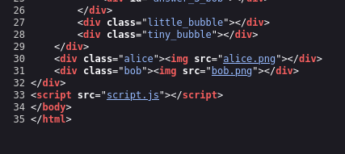

# soal Information Gathering
1. Anda mengunjungi halaman Facebook/situs Web perusahaan target, dengan harapan mendapatkan beberapa nama karyawan perusahaan tersebut, aktivitas ini termasuk?
  - A. Pengintaian Aktif
  - **B. Pengintaian pasif (Benar)**

2. Anda melakukan ping ke alamat IP server web perusahaan untuk memeriksa apakah lalu lintas ICMP diblokir, aktivitas ini termasuk?
  - **A. Pengintaian Aktif (Benar)**
  - B. Pengintaian pasif

3. Anda bertemu dengan administrator TI perusahaan target di sebuah pesta undangan. Anda mencoba menggunakan rekayasa sosial untuk mendapatkan lebih banyak informasi tentang sistem dan infrastruktur jaringan mereka. aktivitas ini termasuk?
  - **A. Pengintaian Aktif (Benar)**
  - B. Pengintaian Pasif

4. target **tryhackme.com**, kapan di daftarkan/registered?
   ```bash
   whois tryhackme.com
   ---
   Updated Date: 2021-05-01T19:43:23Z
   Creation Date: 2018-07-05T19:46:15Z
   Registry Expiry Date: 2027-07-05T19:46:15Z
   ---
   ```
   - **2018-07-05T19:46:15Z**

5. target **tryhackme.com**, Siapa pendaftar/registar?
   ```bash
   whois tryhackme.com
   ---
   Registry Expiry Date: 2027-07-05T19:46:15Z
   Registrar: NameCheap, Inc.
   Registrar IANA ID: 1068
   ---
   ```
   - **namecheap.com**

6. target **tryhackme.com**, Perusahaan mana yang digunakan untuk server nama?
   ```bash
   whois tryhackme.com
   ---
   Domain Status: clientTransferProhibited https://icann.org/epp#clientTransferProhibited
   Name Server: KIP.NS.CLOUDFLARE.COM
   Name Server: UMA.NS.CLOUDFLARE.COM
   DNSSEC: unsigned
   ---
   ```
   **cloudflare.com**

7. Periksa catatan **TXT** dari **thmlabs.com**. cari flag nya dengan format **THM{flag}**?
   ```bash
   nslookup -type=TXT thmlabs.com
   ---
   Non-authoritative answer:
   thmlabs.com	text = "THM{a5b83929888ed36acb0272971e438d78}"
   ---

   dig thmlabs.com TXT
   ---
   ;; ANSWER SECTION:
   thmlabs.com.		261	IN	TXT	"THM{a5b83929888ed36acb0272971e438d78}"
   ---
   ```
   - **THM{a5b83929888ed36acb0272971e438d78}**

8. cari permintaan atau query A atau subdomain yang ditemukan dengan target **smkharapanbangsa.sch.id**? **(BONUS tidak wajib)**
   ```bash
   dnsmap smkharapanbangsa.sch.id
   ---
   blog.smkharapanbangsa.sch.id
   IP address #1: 180.235.151.42

   cpanel.smkharapanbangsa.sch.id
   IP address #1: 180.235.151.42
   ---
   ```

9. apa port ke-2 yang paling umum digunakan untuk server web nginx?
   - go to [https://www.shodan.io/](https://www.shodan.io/)
   - find ```nginx```
     
   - **443**

10. silahkan kunjungi situs https://static-labs.tryhackme.cloud/sites/networking-tcp/ cari ada berapa total pertanyaan?
    - view source code, or inspect
    - go to script.js
      
      
   - and solved the comunication
     

# soal Vulnerability Analysis
1. Temukan berapa IP public dari **v-class.smkharapanbangsa.id**!
   ```bash
   dnsenum v-class.smkharapanbangsa.id
   ###
   Host's addresses:
   __________________

   v-class.smkharapanbangsa.id.             14356    IN    A        103.41.251.35
   ```
   - **1 (103.41.251.35)**

2. Target **v-class.smkharapanbangsa.id**, Berapa saja port yang terbuka?
   ```bash
   nmap -T4 -p- v-class.smkharapanbangsa.id
   ---
   PORT     STATE    SERVICE
   22/tcp   open     ssh
   25/tcp   filtered smtp
   80/tcp   open     http
   179/tcp  filtered bgp
   443/tcp  open     https
   8000/tcp open     http-alt
   ---
   ```
   - **4 (open)**

3. Target **v-class.smkharapanbangsa.id**, sebutkan versi apa yang ada di port 22? 
   ```bash
   nmap -sCV -p22 -T4 v-class.smkharapanbangsa.id
   ---
   PORT   STATE SERVICE VERSION
   22/tcp open  ssh     OpenSSH 8.9p1 Ubuntu 3ubuntu0.10 (Ubuntu Linux; protocol 2.0)
   | ssh-hostkey: 
   |   256 e7:2d:6c:6d:4f:d4:33:0c:a9:bb:e5:b2:82:0d:1c:96 (ECDSA)
   |_  256 75:59:69:e0:70:0f:c6:4a:b2:cd:dc:42:1f:cc:bf:35 (ED25519)
   Service Info: OS: Linux; CPE: cpe:/o:linux:linux_kernel
   ---
   ```
   - **OpenSSH 8.9p1**

4. Target **v-class.smkharapanbangsa.id**, scan menggunakan owasp zap dan donwload report berupa text html! **(BONUS tidak wajib)**
   - saya belum nyoba :v