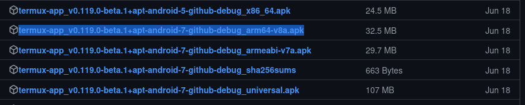
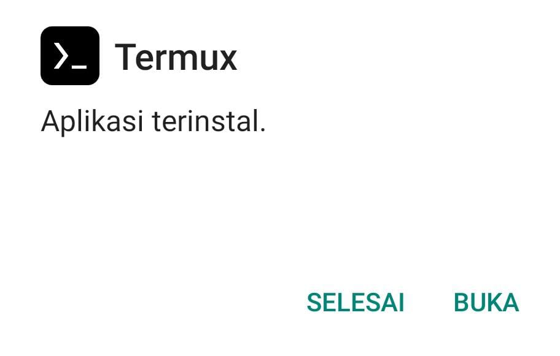
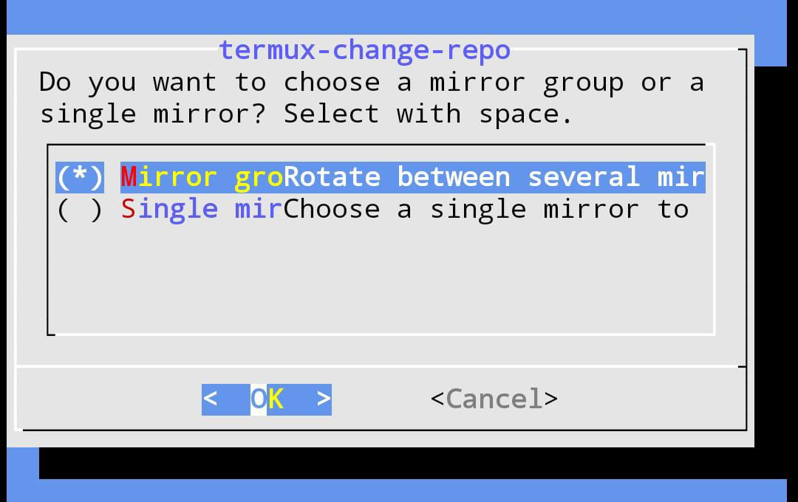
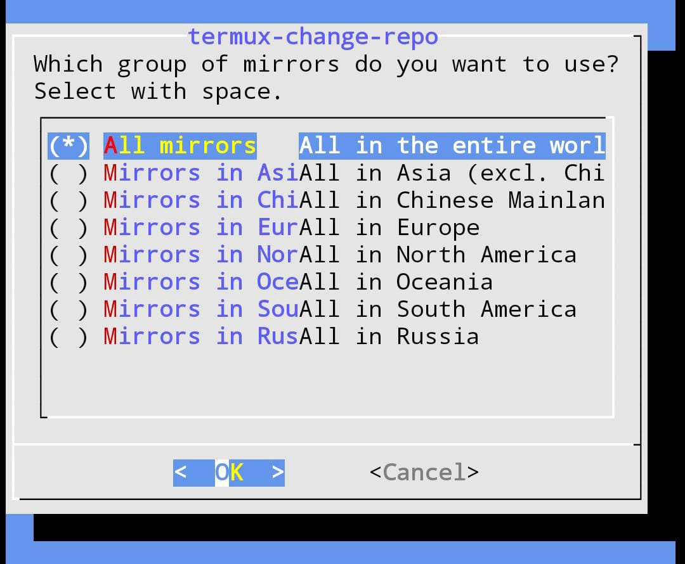
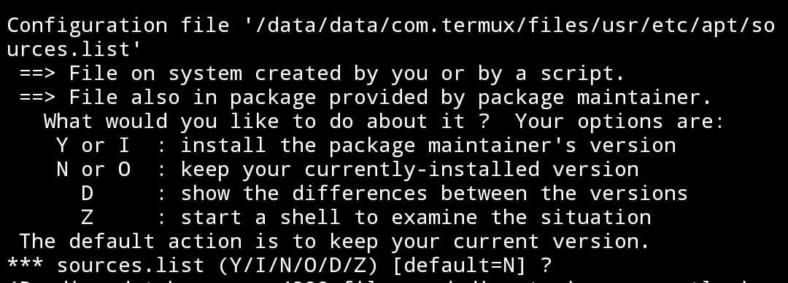

# termux

## Installation
install termux menggunakan salah satu metode ini \
[playstore](https://play.google.com/store/apps/details?id=com.termux) \
[F-Droid](https://f-droid.org/id/packages/com.termux/) \
[github](https://github.com/termux/termux-app/releases) (recomended)

## github
install in github, pilih yang arm64


lalu install aplikasinya \


setelah aplikasi terinstall jalankan perintah ini untuk mensetup storage dan repo
```bash
termux-setup-storage # akses storage
termux-change-repo # change repository
```

pilih ok jika terdapat pilihan




jika sudah kita bisa lakukan update
```bash
pkg update && pkg upgrade
```

jika terdapat pertanyaan kita jawab aja y



jika sudah selesai kita bisa lakukan installasi package (opsional)
```bash
pkg install git wget zip unzip nano
pkg install python python2 python3 ruby
pkg install nodejs clang php # opsional
```