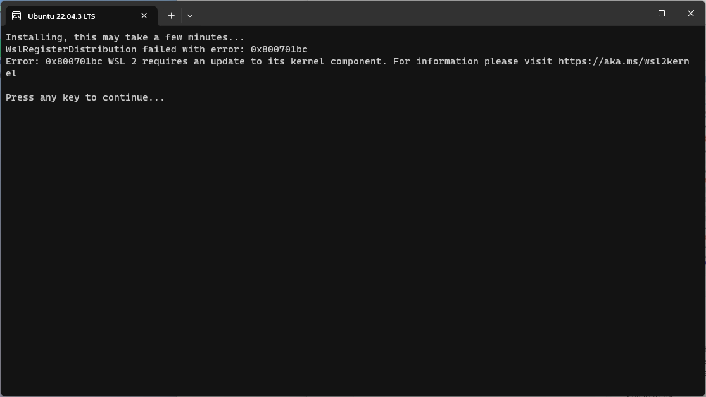

# windowos subsystem linux (WSL)

windows 10 & windows 11

## Installation
install wsl dengan tutorial dibawah ini \
[](https://youtu.be/eId6K8d0v6o) \
[](https://youtu.be/atu6yiy5Nl0?si=wXIDAslrqt_6R5_C)
 
### aktifkan fitur windows subsystem linux
- cari aplikasi Windows Feature (jika bahasa inggris)
  
- lalu aktifkan feature Windows Subsystem For Linux 
  
- lakukan tunggu dan lakukan restart

### install distro yang diinginkan (recomended ubuntu)
```bash
wsl --set-default-version 2
wsl --install
```

### jika sudah terinstall nanti akan seperti ini


jika ingin masuk ke linux wsl yang kita punya masukan perintah ini
```bash
wsl

# atau <nama_distro>

ubuntu
```

### error yang mungkin ditemui

- jika terdapat error seperti di atas coba ubah version nya menjadi 2, jika masih tidak bisa coba versi 1
```bash
wsl --set-default-version 2 
# jika masih gagal ubah 2 jadi 1
# dan lakukan wsl --install lagi
```

- registrasi error 0x80004005
  - https://github.com/microsoft/WSL/issues/10424
- Setting up libc6:amd64 (2.37-14) ...
  - https://github.com/microsoft/WSL/discussions/11097
- wsl error install package *** --configure
  - https://blog.csdn.net/dou3516/article/details/105120221 